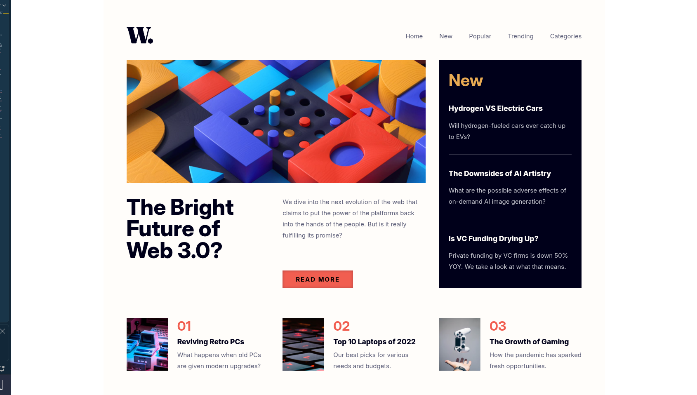

# Frontend Mentor - News homepage solution

This is a solution to the [News homepage challenge on Frontend Mentor](https://www.frontendmentor.io/challenges/news-homepage-H6SWTa1MFl). Frontend Mentor challenges help you improve your coding skills by building realistic projects. 

## Table of contents

- [Overview](#overview)
  - [The challenge](#the-challenge)
  - [Screenshot](#screenshot)
- [My process](#my-process)
  - [Built with](#built-with)
  - [What I learned](#what-i-learned)
  - [Continued development](#continued-development)
  - [Useful resources](#useful-resources)
- [Author](#author)
- [Acknowledgments](#acknowledgments)

## Overview

### The challenge

Users should be able to:

- View the optimal layout for the interface depending on their device's screen size
- See hover and focus states for all interactive elements on the page

### Screenshot

## My process

### Built with

- Semantic HTML5 markup
- CSS custom properties
- Flexbox
- CSS Grid
- JQuery

### What I learned

I learned about JQuery methods to impact on elements style and how I can use the "hamburger" as hidden menu. Moreover I found out the way for using animation for navbar. Additionally I could test grid method of division webpage.

### Continued development

I will be searching for new types of animation and how I can manage semantic tags in grid display more effectively.

### Useful resources

- https://miroslawzelent.pl/kurs-javascript/
- https://digitalportal.pl/box-shadow-generator - It helped in showing previews of some shadows settings
- https://api.jquery.com/animate/ - It was very useful to understand how I can make animation from right edge to the left one

## Author

- Github - [Łukasz Nowak](https://github.com/lukasz-nowak44)

## Acknowledgments

Thanks for Artur and team from https://projekt.przyszlyprogramista.pl/
